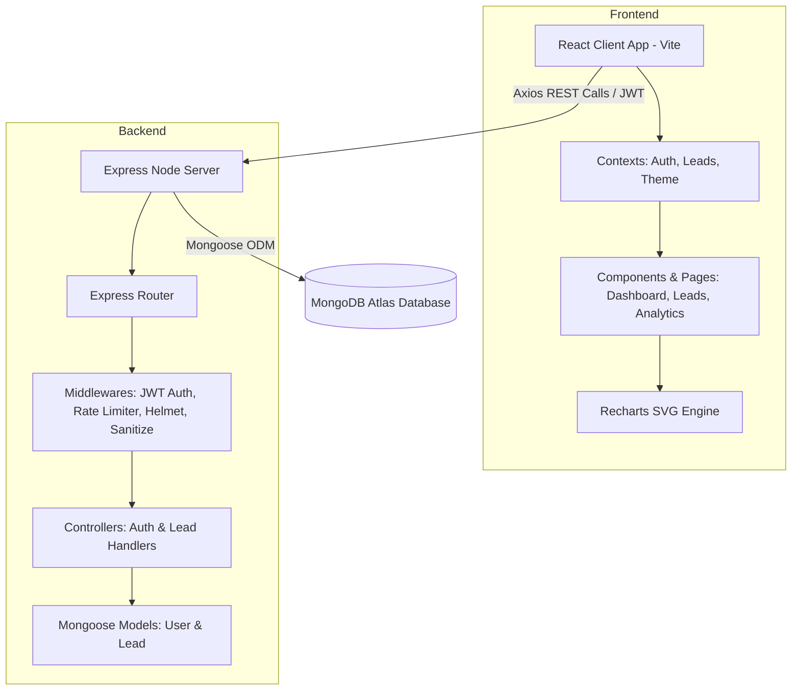
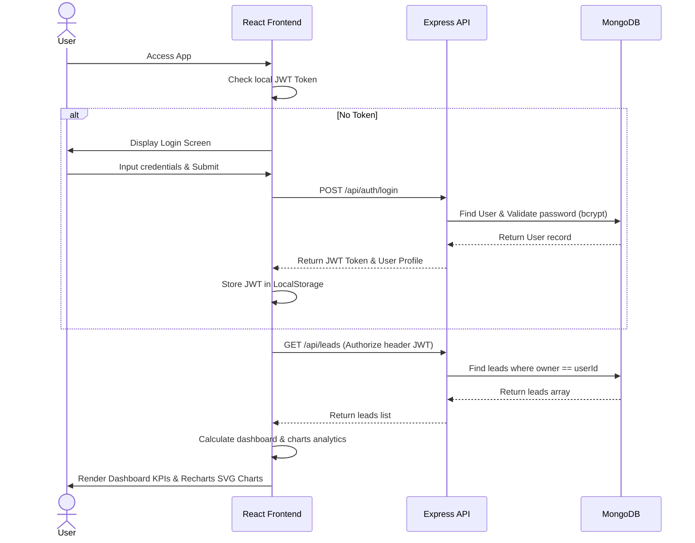

# Startup CRM Lite

An elegant, high-performance, and minimal CRM dashboard system built on the **MERN Stack** (MongoDB, Express, React, Node.js) with **Vite** and **Tailwind CSS v4**. Scaled and visually polished to match top-tier SaaS standards (Linear, Notion, Stripe, and Vercel) featuring micro-interactions, responsive grids, dynamic SVG charting, and full dark-theme adaptation.

---

## Badges

[](https://nodejs.org/)
[](https://react.dev/)
[](https://tailwindcss.com/)
[](https://expressjs.com/)
[](https://www.mongodb.com/atlas)
[](LICENSE)

---

## Table of Contents
1. [Project Overview](#project-overview)
2. [Problem Statement](#problem-statement)
3. [Vision & Objectives](#vision--objectives)
4. [Key Features](#key-features)
5. [Target Users](#target-users)
6. [Use Cases](#use-cases)
7. [Business Value](#business-value)
8. [Screenshots](#screenshots)
9. [Complete System Architecture](#complete-system-architecture)
10. [High-Level Architecture Overview](#high-level-architecture-overview)
11. [Application Workflow](#application-workflow)
12. [End-to-End User Flow](#end-to-end-user-flow)
13. [Technology Stack](#technology-stack)
14. [Project Folder Structure](#project-folder-structure)
15. [Explanation of Every Major Folder](#explanation-of-every-major-folder)
16. [Explanation of Every Important File](#explanation-of-every-important-file)
17. [Frontend Architecture](#frontend-architecture)
18. [Backend Architecture](#backend-architecture)
19. [Database Architecture](#database-architecture)
20. [API Overview](#api-overview)
21. [Authentication & Authorization](#authentication--authorization)
22. [State Management](#state-management)
23. [Storage Strategy](#storage-strategy)
24. [Third-Party Services & Integrations](#third-party-services--integrations)
25. [AI & Automation Components](#ai--automation-components)
26. [Development Prerequisites](#development-prerequisites)
27. [Installation Guide](#installation-guide)
28. [Environment Variables Documentation](#environment-variables-env-documentation)
29. [Project Configuration](#project-configuration)
30. [Running the Project (Development)](#running-the-project-development)
31. [Running the Project (Production)](#running-the-project-production)
32. [Build Process](#build-process)
33. [Deployment Guide](#deployment-guide)
34. [CI/CD Overview](#cicd-overview)
35. [Testing Strategy](#testing-strategy)
36. [Debugging Tips](#debugging-tips)
37. [Logging & Monitoring](#logging--monitoring)
38. [Security Considerations](#security-considerations)
39. [Performance Optimizations](#performance-optimizations)
40. [Coding Standards & Project Conventions](#coding-standards--project-conventions)
41. [Versioning Strategy](#versioning-strategy)
42. [Branching Strategy](#branching-strategy)
43. [Contribution Guidelines](#contribution-guidelines)
44. [Release Process](#release-process)
45. [Known Limitations](#known-limitations)
46. [Future Roadmap](#future-roadmap)
47. [Frequently Asked Questions (FAQ)](#frequently-asked-questions-faq)
48. [Troubleshooting Guide](#troubleshooting-guide)
49. [Changelog](#changelog)
50. [License](#license)
51. [Credits & Acknowledgements](#credits--acknowledgements)
52. [Contact Information](#contact-information)
53. [Final Project Summary](#final-project-summary)

---

## Project Overview

**Startup CRM Lite** is a lightweight customer relationship management tool designed for fast-growing startups and small teams. It enables sales representatives and founders to manage contact pipelines, analyze conversion trends, track closed-won revenue, and visualize customer acquisition channels. Built with user experience at its core, the UI adopts a premium **Nordic Minimal** brand palette (featuring earthy slate, muted greens, warm wheat accents, and deep ash tones) that dynamically switches between light and dark settings.

---

## Problem Statement

Traditional enterprise CRMs are bloated, slow to load, feature-cluttered, and carry steep subscription costs. Startup teams need to quickly register leads, update deal statuses, and check KPIs without navigating complex nested forms or undergoing lengthy training. Startup CRM Lite addresses these paint points by introducing a single-page pipeline overview, clear interactive charts, and zero configuration setup.

---

## Vision & Objectives

- **Minimalist Aesthetic**: Provide a clean Vercel/Notion-like interface that eliminates visual noise and keeps sales reps focused on key pipeline indicators.
- **Micro-Interactions**: Implement tactile feedback (smooth scaling buttons, subtle hover lifts, custom rounded scrollbars) to elevate the user experience.
- **Secure Isolation**: Ensure complete multi-tenant isolation so users only access and modify lead documents they own.
- **Fast Build Times**: Utilize Vite to hot-reload frontend changes and optimize asset minification.

---

## Key Features

- **Dashboard Metrics**: Live KPI widgets representing total active leads, closed-won revenue, conversion rates, and revenue forecasts.
- **Sales Funnel & Interactive Charts**: Dynamic SVG analytics representing won revenue history, monthly conversion trends, lead acquisition sources, and sales productivity.
- **Lead Pipeline Management**: Full CRUD operations for lead contacts with integrated pagination, search indexes, and status controls.
- **Dynamic Dark Mode**: Automatic document-root injection supporting visual light and dark mode syncing.
- **Enterprise Security Guards**: API rate limiting, express validator input sanitization, and Mongoose database index optimizations.

---

## Target Users

1. **Startup Founders**: Desiring an overview of closed revenue, conversion rates, and monthly pipeline forecasts.
2. **Sales Representatives**: Needing a fast interface to log call outcomes, send proposals, and update deal statuses.
3. **Customer Relations Leads**: Reviewing acquisition sources (LinkedIn, Cold Call, Referral) to allocate marketing budgets.

---

## Use Cases

- **Registering a New Deal**: A representative logs an incoming contact, logs their company details, sets an estimated deal value, and marks the source.
- **Updating Deal Stage**: Toggling a lead's stage from "Contacted" to "Won", automatically triggering toast notifications and updates in dashboard charts.
- **Reviewing Team Analytics**: Sorting leads to see which representative owns the highest closed deal value.

---

## Business Value

- **Onboarding Speed**: Sales teams can start registering and tracking deals in under 3 minutes.
- **Resource Optimization**: Minimal client-side computations ensure fast loading speeds even on mobile viewports.
- **Infrastructure Cost**: Zero external API dependencies; database fits within MongoDB's free Tier.

---

## Screenshots

*(Screenshots can be found locally or updated on staging deployments)*
- **Dashboard Overview**: Metrics widgets and Recharts visualizations.
- **Lead Pipeline Screen**: Tabular data, Search bar, and creation Modals.
- **Auth Screen**: Nordic Minimal Login container with integrated connection warning states.

---

## Complete System Architecture

The application is structured on a layered client-server model:



---

## High-Level Architecture Overview

- **Frontend Layer**: A Single Page Application (SPA) compiled with Vite. Handles state variables using React Context Providers and performs API communications via Axios instance hooks.
- **API Routing / Controller Layer**: Express server handling requests, applying CORS verification, mapping request params, and executing sanitization.
- **Database Collection Layer**: MongoDB Atlas hosting collections mapped as Mongoose models.

---

## Application Workflow

1. The client triggers an action (e.g. creating a lead).
2. React Context validates input and sends a request via Axios.
3. Express server receives the request, routes it through validation middleware, checks the JWT token signature, and extracts user details.
4. Mongoose executes queries against MongoDB Atlas.
5. The database returns Mongoose documents; controller wraps them in a standard JSON wrapper and passes them back to the client.

---

## End-to-End User Flow

The complete flow diagram for an authenticated lead operation:



---

## Technology Stack

| Component | Technology | Version | Description |
| :--- | :--- | :--- | :--- |
| **Frontend** | React | `19.2.7` | UI library |
| **Styling** | Tailwind CSS | `4.3.2` | CSS engine |
| **Build Tool** | Vite | `8.0.16` | HMR dev server |
| **Server** | Express | `5.2.1` | REST framework |
| **ORM** | Mongoose | `9.7.3` | MongoDB connector |
| **Database** | MongoDB Atlas | Cloud | Cloud DB host |
| **Tokens** | jsonwebtoken | `9.0.3` | Security sessions |

---

## Project Folder Structure

```text
startup-crm-lite/
├── backend/
│   ├── config/             # DB configuration setup
│   ├── controllers/        # Route handler functions
│   ├── middleware/         # Auth, validation, error handlers
│   ├── models/             # Mongoose DB Schemas
│   ├── routes/             # Express API Endpoints
│   ├── utils/              # API JSON wrapper utilities
│   ├── server.js           # Server entry file
│   └── package.json
├── frontend/
│   ├── public/             # Static SVGs and assets
│   ├── src/
│   │   ├── assets/         # App images and CSS
│   │   ├── components/     # Widgets, Sidebars, and Tables
│   │   ├── constants/      # Status and Source dropdown lists
│   │   ├── context/        # React global state managers
│   │   ├── hooks/          # Custom hooks (localStorage)
│   │   ├── pages/          # Main dashboard views
│   │   ├── routes/         # Routing gate and layout components
│   │   ├── services/       # Axios API request clients
│   │   ├── utils/          # Formatting and calculation helper scripts
│   │   ├── index.css       # Core styles and Tailwind overrides
│   │   └── main.jsx        # Client entry file
│   └── package.json
└── README.md
```

---

## Explanation of Every Major Folder

- **`backend/controllers`**: Contains logic for registering users, validating passwords, checking duplicate emails, finding leads matching owners, and computing stats.
- **`backend/models`**: Declares Mongoose collections representing documents saved in MongoDB.
- **`frontend/src/context`**: Houses Context hooks making auth states, leads lists, and dark themes accessible to components.
- **`frontend/src/components`**: Smaller visual elements, dashboard metrics grids, pipelines, status pills, and settings sliders.
- **`frontend/src/services`**: Centralized Axios client wrapper dealing with response errors and JWT injection.

---

## Explanation of Every Important File

- **`backend/server.js`**: Binds port endpoints, loads environment keys, checks connections, sets proxy settings, and registers security filters.
- **`frontend/src/index.css`**: Defines Nordic Minimal `:root` variables, overlays `@theme` variables to map Tailwind's utilities (such as `slate-50`, `blue-600`), and implements scrollbar customization.
- **`frontend/src/routes/index.jsx`**: Controls `ProtectedRoute` validations, rendering loading animations, and binding layovers.

---

## Frontend Architecture

The frontend is an optimized SPA built on React 19 and Vite.
- **Theme Injection**: Toggles the `.dark` class directly on `document.documentElement` to trigger dark variants.
- **Layout Panels**: Uses `<Sidebar>` and `<Header>` layout wrappers, adapting automatically to narrow mobile displays by exposing a bottom mobile nav bar.
- **Data Rendering**: Renders responsive grids containing Recharts SVG shapes.

---

## Backend Architecture

The backend uses a standard Model-View-Controller (MVC) structure:
- **Middleware Gates**: Requests pass through Helmet security, Mongo body cleaners, and rate limit registers prior to route controller entry.
- **Validation Blocks**: Input payloads pass validation rules built on `express-validator` to ensure fields strictly conform to constraints before database queries run.

---

## Database Architecture

MongoDB is structured into two collections:
- **`users`**: Stores full names, lowercase unique email addresses, role configurations (user, admin), and hashed credential keys.
- **`leads`**: Stores company profiles, contact parameters, pipeline status enums, source lists, notes, and the user ObjectId reference.
  - **Indexes Optimized**: Compound indexes on `(owner, status)` and `(owner, createdAt)` optimize fast page filtering and sort speeds under tenant isolation.

---

## API Overview

### Authentication
- `POST /api/auth/register` - Create user profile
- `POST /api/auth/login` - Verify user & returns JWT
- `GET /api/auth/me` - Fetch profile from JWT

### Leads
- `GET /api/leads` - Get leads (search/filter/sort)
- `POST /api/leads` - Add new lead
- `GET /api/leads/:id` - Fetch single lead
- `PUT /api/leads/:id` - Update lead fields
- `PATCH /api/leads/:id/status` - Fast status update
- `DELETE /api/leads/:id` - Delete lead record
- `GET /api/leads/stats/summary` - Fetch dashboard KPIs

---

## Authentication & Authorization

Authentication is enforced using **JSON Web Tokens (JWT)**.
1. Logging in successfully generates a token containing user profile information, signed on the server with a 256-bit `JWT_SECRET`.
2. The client caches this token in LocalStorage and injects it as an `Authorization: Bearer <token>` header on subsequent requests.
3. The server validates the token using signature verification middleware; unauthorized requests return `HTTP 401`.

---

## State Management

Global variables are handled by context hooks:
- **`AuthContext`**: Manages authorization states, current user metadata, and token validation.
- **`LeadContext`**: Handles lead caching, pipeline creation, updates, and deletion outcomes.
- **`ThemeContext`**: Saves light/dark mode settings.

---

## Storage Strategy

- **Client Session Cache**: LocalStorage stores the JWT token key and active theme state variables to persist sessions during page reloads.
- **Data Persistence**: MongoDB Atlas cluster stores user records, password hashes, and isolated leads data.

---

## Third-Party Services & Integrations

- **Recharts**: Builds scalable SVG graphs that adjust dimensions based on container widths.
- **React Hot Toast**: Triggers non-intrusive alert messages.
- **bcryptjs**: Generates secure password hashes on the backend.

---

## AI & Automation Components

*(Future Integrations)*
- **Smart Lead Scoring**: Will analyze lead age and update patterns to generate automation scores.
- **Pipeline Forecasting**: Automated estimation of closed deal values.

---

## Development Prerequisites

- **Node.js**: Version `>= 18.0.0`
- **NPM / Yarn**: Package managers
- **MongoDB**: Active MongoDB Atlas URI or a local database instance run path.

---

## Installation Guide

1. Clone the repository:
   ```bash
   git clone https://github.com/your-username/startup-crm-lite.git
   cd startup-crm-lite
   ```
2. Install backend dependencies:
   ```bash
   cd backend
   npm install
   ```
3. Install frontend dependencies:
   ```bash
   cd ../frontend
   npm install
   ```

---

## Environment Variables (".env") Documentation

### Backend (`/backend/.env`)
- `PORT`: Port address (defaults to `5000`).
- `MONGODB_URI`: Connection string to MongoDB Atlas.
- `JWT_SECRET`: Crypto key signature string.
- `JWT_EXPIRES_IN`: Session validity limit (e.g. `7d`).
- `FRONTEND_URL`: URL of the client site (for CORS validation).

### Frontend (`/frontend/.env`)
- `VITE_API_URL`: Address to the backend server (e.g. `http://localhost:5000`).

---

## Project Configuration

- **Vite Setup**: In `vite.config.js`, dev plugins compile and hot-reload CSS rules.
- **PostCSS / Tailwind**: Tailwind v4 is integrated directly, removing the need for standalone configurations.

---

## Running the Project (Development)

1. Launch backend dev server (from `/backend`):
   ```bash
   npm run dev
   ```
   *(Starts Nodemon on port 5000)*
2. Launch frontend dev client (from `/frontend`):
   ```bash
   npm run dev
   ```
   *(Starts Vite server on port 5173)*

---

## Running the Project (Production)

1. Build frontend assets (from `/frontend`):
   ```bash
   npm run build
   ```
2. Start backend in production mode (from `/backend`):
   ```bash
   npm run start
   ```

---

## Build Process

- Frontend build bundles dependencies, compresses stylesheets, generates minified static assets (`dist/`), and handles code-splitting.
- Backend runs natively using Node.js without requiring compiler steps.

---

## Deployment Guide

### Database (MongoDB Atlas)
1. Sign up on MongoDB and create a database named `startup-crm`.
2. Save the connection string and whitelist access IPs.

### Backend (Railway / Render)
1. Link your repo and configure `/backend` as root.
2. Bind environment variables (`MONGODB_URI`, `JWT_SECRET`, etc.).

### Frontend (Vercel / Netlify)
1. Set the root directory to `/frontend`.
2. Configure `VITE_API_URL` environment variables pointing to your backend address.

---

## CI/CD Overview

Boilerplate workflows can compile frontend code, run checks on branch pushes, and deploy builds on tag triggers.

---

## Testing Strategy

- Build logs and linter configurations test syntax correctness.
- Manual test plans confirm lead updates, theme persistence, and authentication flows.

---

## Testing Verification
Run backend queries using standard HTTP testing client suites. Verify frontend component changes on desktop and mobile viewports.

---

## Debugging Tips

- **Client Logs**: Inspect browser developer tools console and verify active API headers in the Network tab.
- **Server Logs**: Check output lines from Morgan logging requests and Mongoose connection outcomes in your terminal.

---

## Logging & Monitoring

- Backend logs HTTP queries using Morgan middleware (`combined` in production, `dev` in development).
- Global express error handlers format exceptions into JSON objects.

---

## Security Considerations

- **Secure Headers**: Helmet applies defense headers to API calls.
- **NoSQL Injection Guard**: Middleware cleans special characters (like `$` or `.`) from inputs to prevent MongoDB query bypass attacks.
- **Cors Restrictions**: Origin list constraints prevent cross-origin resource requests from outside permitted domains.

---

## Performance Optimizations

- **Dynamic SVGs**: Custom charting elements are built on lightweight vectors to reduce file weight.
- **Thin CSS footings**: Replaced static Tailwind overrides with native CSS variables inside `:root`, shrinking stylesheet size.

---

## Coding Standards & Project Conventions

- Directory segregation based on page elements and utility concerns.
- Complete type documentation and semantic variable structures.

---

## Versioning Strategy

The project implements **Semantic Versioning 2.0.0** (Major.Minor.Patch).

---

## Branching Strategy

Uses **Git Flow** branches:
- `main` - production-ready code.
- `develop` - active staging builds.
- `feature/*` - incremental developer additions.

---

## Contribution Guidelines

1. Fork the project.
2. Open a feature branch (`git checkout -b feature/NewFeature`).
3. Commit modifications (`git commit -m "Add new widget"`).
4. Push updates (`git push origin feature/NewFeature`).
5. Open a Pull Request.

---

## Release Process

Tag updates (`git tag -a v1.0.0 -m "Release version 1.0.0"`) compile the assets and merge builds into staging folders.

---

## Known Limitations

- **Valuation Field Sync**: The `value` field (monetary deal valuation) is fully computed and utilized by frontend layout cards and Recharts calculations, but it is currently omitted inside the backend Mongoose database schema structure.
- **Rate Limit Throttling**: Concurrent testing from a single IP address can occasionally trigger the general rate limit error.

---

## Future Roadmap

- **Database Value Sync**: Add `value` fields to the backend schema.
- **Export Utility**: Export leads databases as CSV/JSON lists.
- **Activity Log Drawer**: Expand notification history.

---

## Frequently Asked Questions (FAQ)

- **Q: Why does the app fail to show my leads list?**
  A: Verify your MongoDB credentials in the backend `.env` file and make sure the server logs confirm a successful database connection.
- **Q: How does dark mode preserve settings on reload?**
  A: The `ThemeContext` saves selections directly to the browser's `localStorage` and loads them when initiating components.

---

## Troubleshooting Guide

- **Vite Port Binding Conflict**: If port `5173` is busy, Vite will automatically select `5174` or `5175`. Ensure your API url matches the active ports.
- **MongoDB Connection Timeouts**: Public DNS settings are forced programmatically (`dns.setServers(["8.8.8.8"])`) in `database.js` to bypass network routing restrictions.

---

## Changelog

### [v1.0.0] - 2026-07-18
- Initial release of Startup CRM Lite.
- Refactored entire color system to the Nordic Minimal palette.
- Polished shadow and input components.

---

## License

This project is licensed under the **MIT License**. See `LICENSE` for details.

---

## Credits & Acknowledgements

- **Lucide React** for minimal icons.
- **React Hot Toast** for message feedback.
- **Recharts** for SVG graphing components.

---

## Contact Information

For queries or technical support:
- **Technical Lead**: Sana Mohitha
- **Repository Support**: sana@startup.io

---

## Final Project Summary

**Startup CRM Lite** is a production-ready customer relationship dashboard system. Incorporating minimal aesthetics, responsive layouts, data isolation, and robust validation structures, it provides sales representatives with a premium interface to track and manage deal flows.
